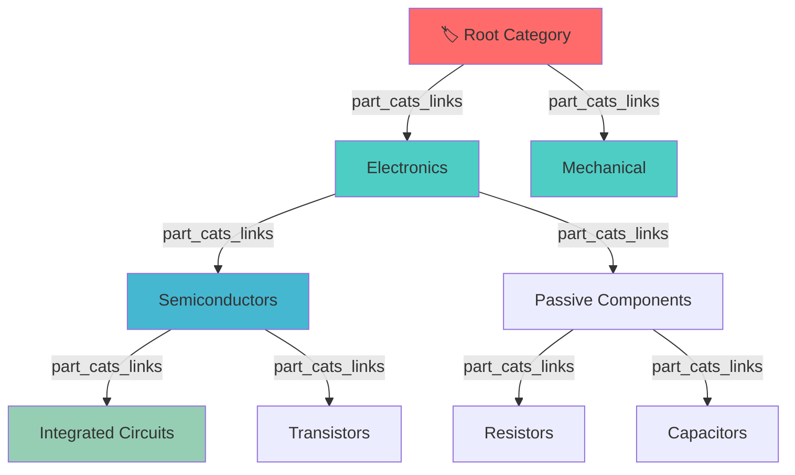
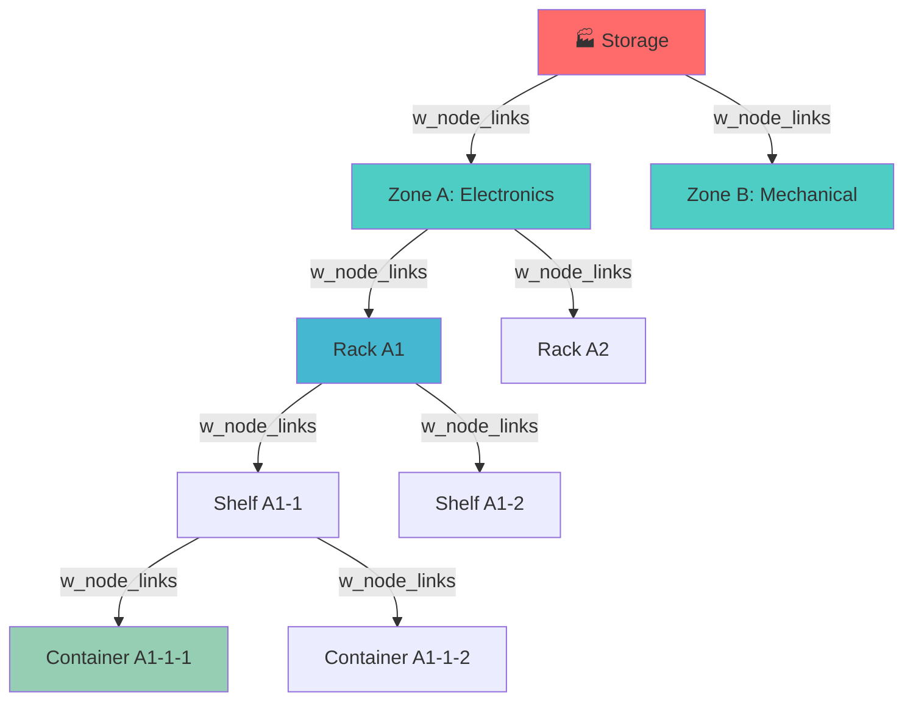
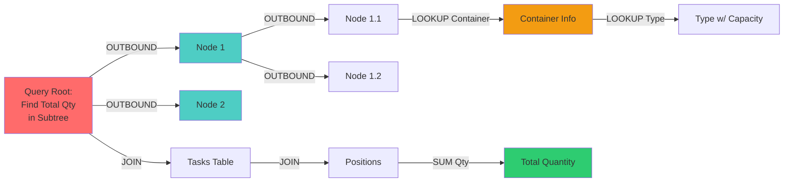
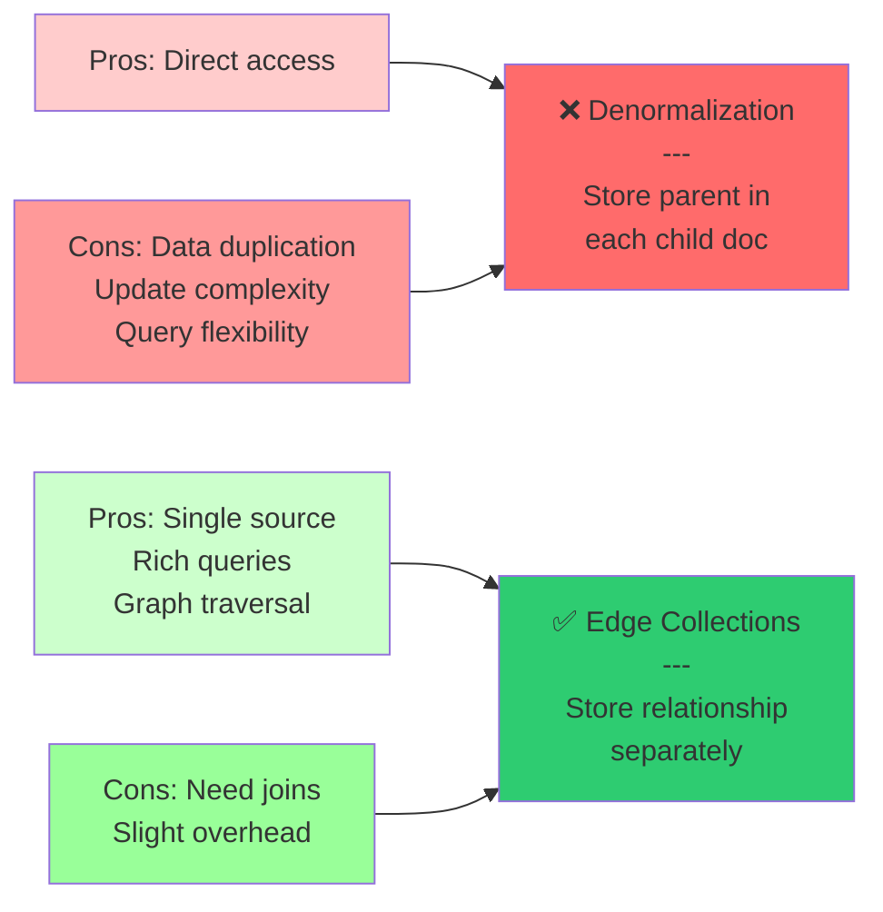
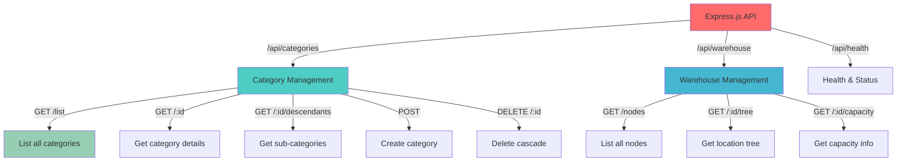

# ArangoDB Edge Patterns in Enterprise ERP Systems

A comprehensive showcase of advanced ArangoDB edge collection patterns used in real-world enterprise resource planning (ERP) systems. This repository demonstrates practical implementations of hierarchical relationships, traversal queries, and graph-based data operations.

## 🚀 Quick Start

### Prerequisites

- Docker & Docker Compose
- Node.js 16+
- npm

### Setup

```bash
# Start ArangoDB
docker-compose up -d

# Install dependencies
npm install

# Seed sample data
npm run seed

# Start development server
npm run dev

# Server runs on http://localhost:6000
```

## 📚 What You'll Learn

This repository showcases **three core edge patterns** used in production ERP systems:

### Pattern 1: Hierarchical Category Trees

**Use Case**: Product categorization with inherited properties



**Key Operations**:

- Find all descendants at specific depth
- Retrieve hierarchical properties
- Delete with cascade behavior
- Validate parent-child relationships

---

### Pattern 2: Warehouse Node Hierarchy

**Use Case**: Storage location structure with capacity tracking



**Key Operations**:

- Bidirectional traversal (ancestors and descendants)
- Location-based inventory queries
- Capacity calculations across hierarchy
- Dynamic property fetching from related node types

---

### Pattern 3: Advanced Traversals & Aggregations

**Use Case**: Complex multi-level queries with related data



**Key Operations**:

- Multi-level OUTBOUND/INBOUND traversals
- Cross-collection joins
- Conditional aggregations
- Performance-optimized queries

---

## 📁 Repository Structure

```
arango-edge-patterns-erp/
├── README.md                          # This file
├── docs/
│   ├── edge-patterns-explained.md     # Detailed pattern explanations
│   ├── architecture.md                # System design & relationships
│   ├── performance-guide.md           # Optimization & indexing
│   └── query-patterns.md              # Common query templates
├── examples/
│   ├── 01-hierarchical-categories/
│   │   ├── schema.aql                 # Collection definitions
│   │   ├── queries.aql                # AQL query patterns
│   │   └── relations.md               # Entity relationships
│   ├── 02-warehouse-hierarchy/
│   │   ├── schema.aql
│   │   ├── queries.aql
│   │   └── relations.md
│   └── 03-advanced-traversals/
│       ├── queries.aql
│       └── use-cases.md
├── src/
│   ├── index.ts                       # Express.js entry point
│   ├── db.ts                          # ArangoDB connection
│   ├── models/
│   │   ├── PartCategory.ts            # Category model
│   │   ├── WarehouseNode.ts           # Warehouse node model
│   │   └── types.ts                   # TypeScript interfaces
│   ├── queries/
│   │   ├── categories.ts              # Category queries
│   │   ├── warehouse.ts               # Warehouse queries
│   │   └── traversal.ts               # Generic traversal utilities
│   ├── utils/
│   │   └── logger.ts
│   └── routes/
│       ├── categories.ts              # Category endpoints
│       ├── warehouse.ts               # Warehouse endpoints
│       └── health.ts                  # Health check
├── docker-compose.yml                 # ArangoDB setup
├── seed-data.aql                      # Sample data for demos
├── tsconfig.json                      # TypeScript config
├── package.json
└── .env.example                       # Environment variables
```

## 🔍 Core Concepts

### What are Edges?

Edges in ArangoDB are collections that store relationships between documents. They have special `_from` and `_to` fields pointing to document IDs.

```typescript
// Document Collection
{ _key: "electronics", name: "Electronics", ... }

// Edge Collection
{ _key: "semiconductors->electronics", _from: "categories/semiconductors", _to: "categories/electronics" }
```

### Why Use Edges Instead of Denormalization?



## 📖 Examples Overview

### 1. Hierarchical Categories

- **File**: `examples/01-hierarchical-categories/`
- **Demonstrates**:
    - Creating multi-level category trees
    - Querying all descendants at any depth
    - Filtering categories by parent
    - Handling cascade deletions
    - Inherited property traversal

**Query Example**:

```aql
FOR doc, edge, path IN 1..LEVELS OUTBOUND parent part_cats_links
  FILTER doc._deleted == null
  RETURN doc
```

### 2. Warehouse Hierarchy

- **File**: `examples/02-warehouse-hierarchy/`
- **Demonstrates**:
    - Building location trees (Storage → Zone → Rack → Shelf)
    - Finding ancestors (get parent storage of any location)
    - Finding descendants (all sub-locations)
    - Aggregating quantities across hierarchy
    - Lookup related collections (node types, containers)

**Query Example**:

```aql
FOR node, edge, path IN 1..DEPTH OUTBOUND parent w_node_links
  LET containers = (FOR c IN w_containers FILTER c.node == node._key RETURN c)
  RETURN { node, containers }
```

### 3. Advanced Traversals

- **File**: `examples/03-advanced-traversals/`
- **Demonstrates**:
    - Multi-collection joins with edges
    - Conditional aggregations
    - Performance-optimized patterns
    - Error handling and constraints

## 🛠️ API Endpoints



## 📊 Performance Considerations

### Indexing Strategy

The showcase includes indexes on common query patterns:

```aql
// Index on edge traversal starting points
db.part_cats_links.ensureIndex({fields: ["_from", "_to"], type: "persistent"})

// Index on deletion checks
db.part_cats.ensureIndex({fields: ["_deleted"]})
```

### Query Optimization Tips

1. **Use path constraints**: Specify min/max levels to avoid full traversals
2. **Filter early**: Apply filters as close to collection scan as possible
3. **Reduce RETURN data**: Select only needed fields
4. **Use COLLECT for aggregations**: Instead of multiple queries

## 🔒 Real-World Use Cases

### Use Case 1: Product Hierarchy with Inherited Specs

```
Electronics
├── Semiconductors (tolerance: ±10%)
│   ├── ICs (supply: international)
│   └── Transistors (supply: regional)
└── Passives (tolerance: ±5%)
    ├── Resistors
    └── Capacitors
```

Each level can inherit parent specs while allowing overrides.

### Use Case 2: Multi-Warehouse Inventory

```
Enterprise
├── Warehouse A (capacity: 1000 units)
│   ├── Zone A (capacity: 300 units)
│   │   └── Rack A1 (capacity: 75 units)
│   └── Zone B (capacity: 700 units)
└── Warehouse B (capacity: 2000 units)
```

Calculate real-time capacity across any subtree instantly.

### Use Case 3: Supply Chain Lineage

Track materials → parts → assemblies → products using edges to understand complete dependency trees and impact analysis.

## 📚 Documentation

- [Edge Patterns Explained](docs/edge-patterns-explained.md) - Deep dive into each pattern
- [Architecture Guide](docs/architecture.md) - System design decisions
- [Performance Guide](docs/performance-guide.md) - Optimization strategies
- [Query Patterns](docs/query-patterns.md) - Common templates

## 🧪 Testing

```bash
# Run all tests
npm test

# Run specific example
npm run test:categories

# Run with coverage
npm test -- --coverage
```

## 🚀 Deployment

See [DEPLOYMENT.md](docs/deployment.md) for production considerations.

## 📄 License

MIT

## 🤝 Contributing

This is a showcase repository. Feel free to fork and adapt to your use cases!

---

**Built with ❤️ as an enterprise ERP pattern showcase** | [ArangoDB Documentation](https://www.arangodb.com/docs/)
