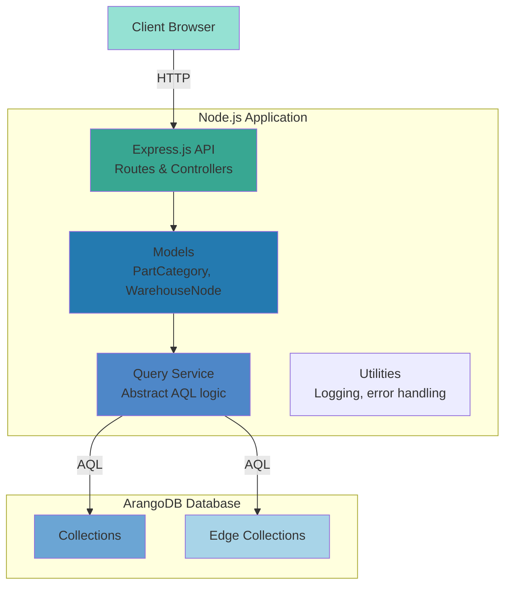
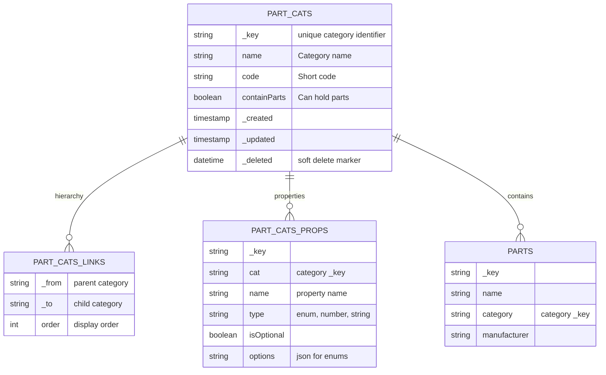
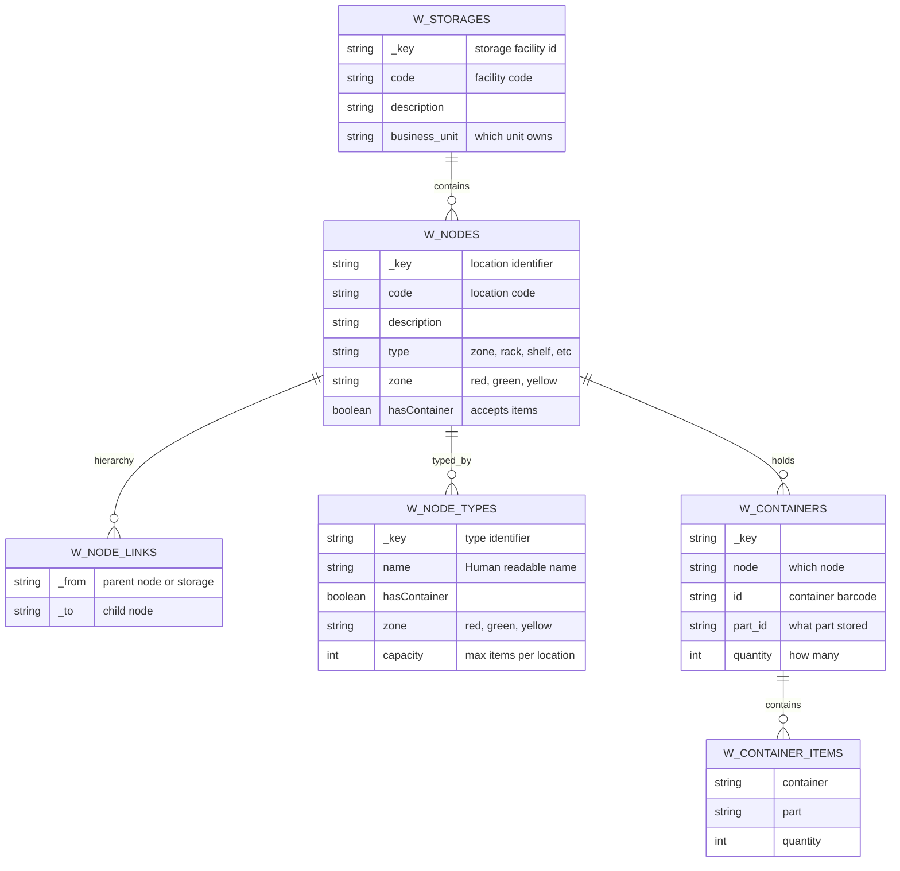
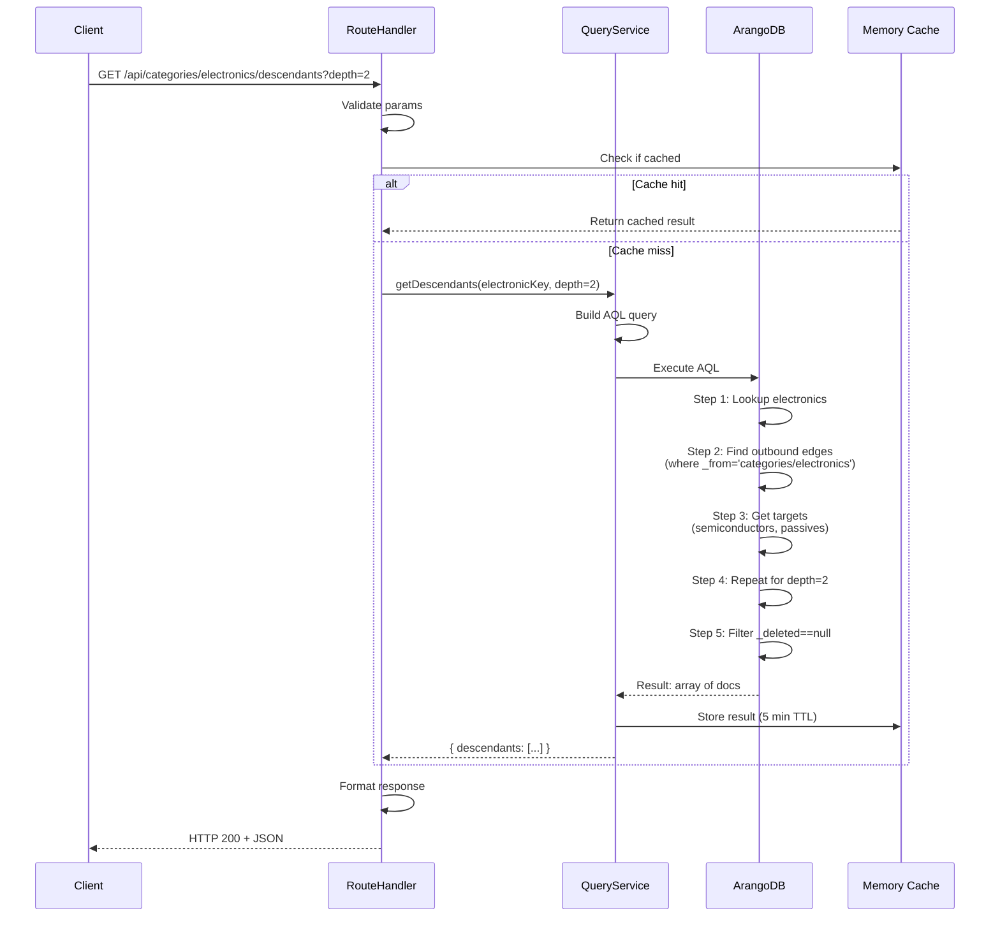
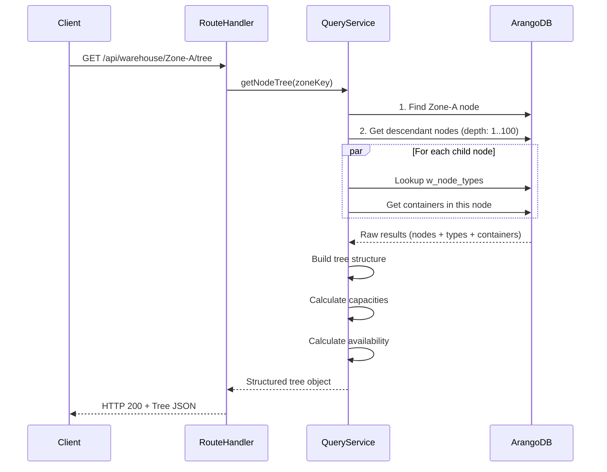
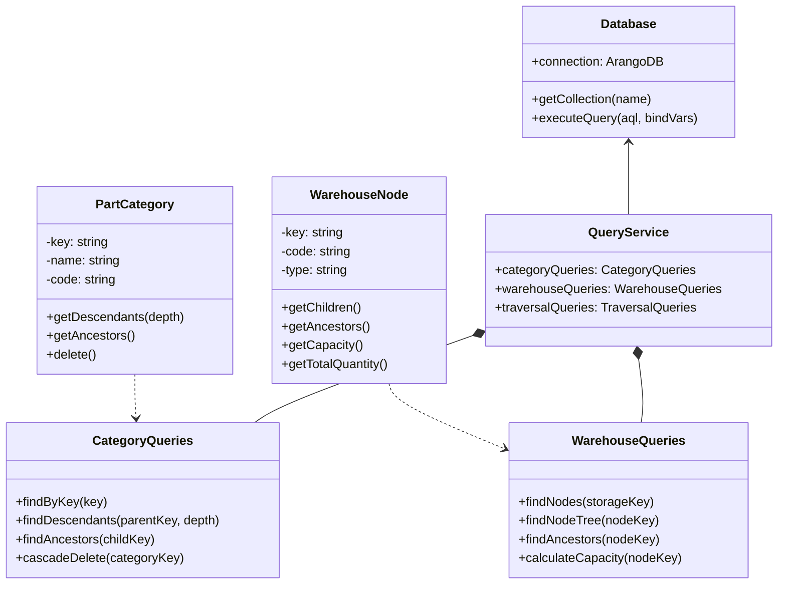
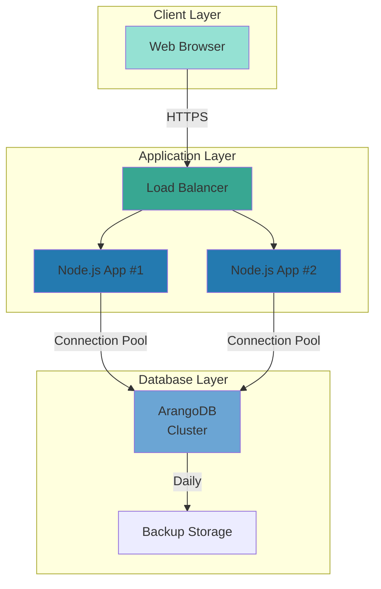

# System Architecture

## Overall System Design



## Data Collections

### Part Categories System



### Warehouse System



## Request Flow: Get Category Descendants



## Request Flow: Get Warehouse Node Tree with Capacity



## Class Hierarchy



## TypeScript Type System

```typescript
// Models
interface PartCategory {
  _key: string;
  _id: string;
  name: string;
  code: string;
  containParts: boolean;
  _created: Date;
  _updated: Date;
  _deleted?: Date;
}

interface PartCategoryLink {
  _key: string;
  _from: string;  // "part_cats/parent_id"
  _to: string;    // "part_cats/child_id"
  order: number;
}

interface WarehouseNode {
  _key: string;
  code: string;
  description: string;
  type: string;
  zone: 'red' | 'green' | 'yellow';
  hasContainer: boolean;
}

interface NodeLink {
  _key: string;
  _from: string;  // "w_nodes/parent_id" or "w_storages/storage_id"
  _to: string;    // "w_nodes/child_id"
}

// Query Results
interface DescendantsResult {
  _key: string;
  name: string;
  level: number;
  path: string[];
}

interface NodeTreeResult {
  node: WarehouseNode;
  capacity: number;
  used: number;
  available: number;
  children: NodeTreeResult[];
}
```

## API Response Signatures

### Category Endpoints

```typescript
// GET /api/categories/list
Response: {
  success: boolean;
  data: PartCategory[];
  count: number;
}

// GET /api/categories/:id/descendants
Response: {
  success: boolean;
  data: DescendantsResult[];
  parent: PartCategory;
  depth: number;
}

// POST /api/categories
Body: { name: string; code: string; parentId?: string }
Response: {
  success: boolean;
  data: PartCategory;
  message: string;
}

// DELETE /api/categories/:id
Response: {
  success: boolean;
  deletedCount: number;
  deletedEdgeCount: number;
  message: string;
}
```

### Warehouse Endpoints

```typescript
// GET /api/warehouse/nodes/:id/tree
Response: {
  success: boolean;
  data: NodeTreeResult;
  generatedAt: ISO8601;
}

// GET /api/warehouse/nodes/:id/ancestors
Response: {
  success: boolean;
  path: WarehouseNode[];
  depth: number;
}

// GET /api/warehouse/capacity/:nodeId
Response: {
  success: boolean;
  node: WarehouseNode;
  capacity: number;
  used: number;
  available: number;
  utilizationPercent: number;
}
```

## Deployment Architecture



---

**Next**: Read [performance-guide.md](performance-guide.md) for optimization strategies.
