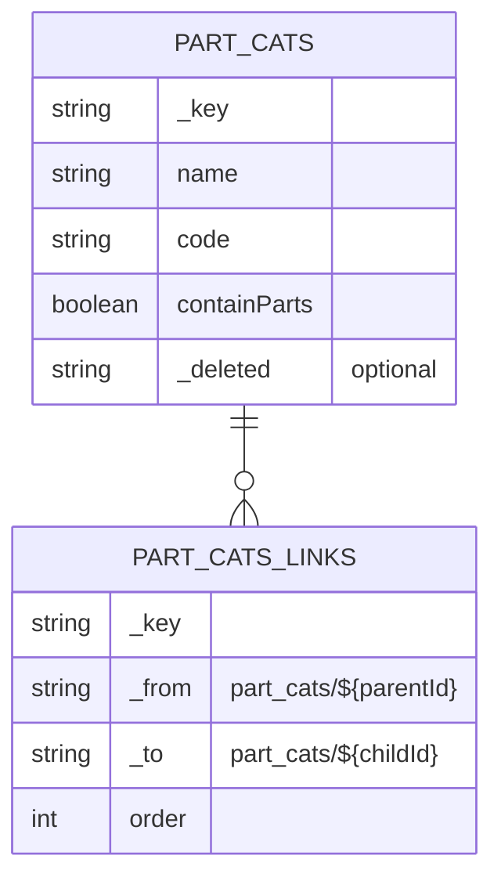
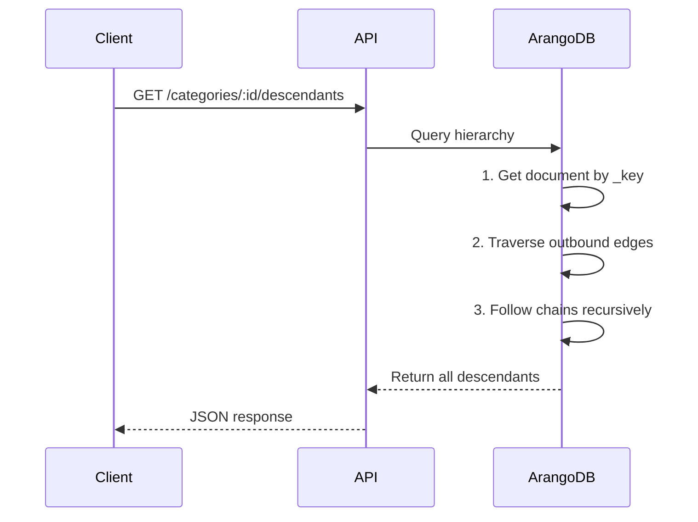
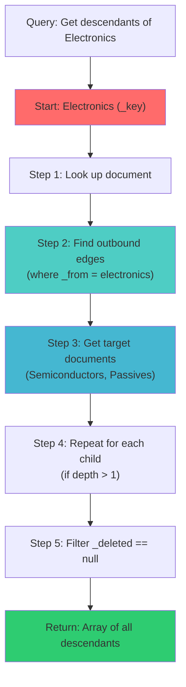
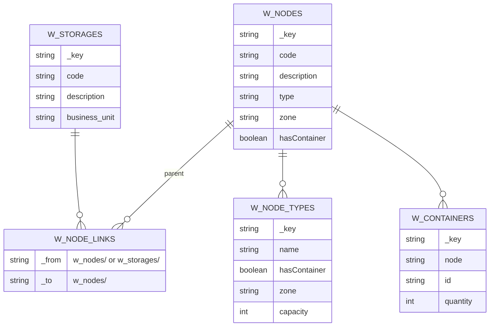
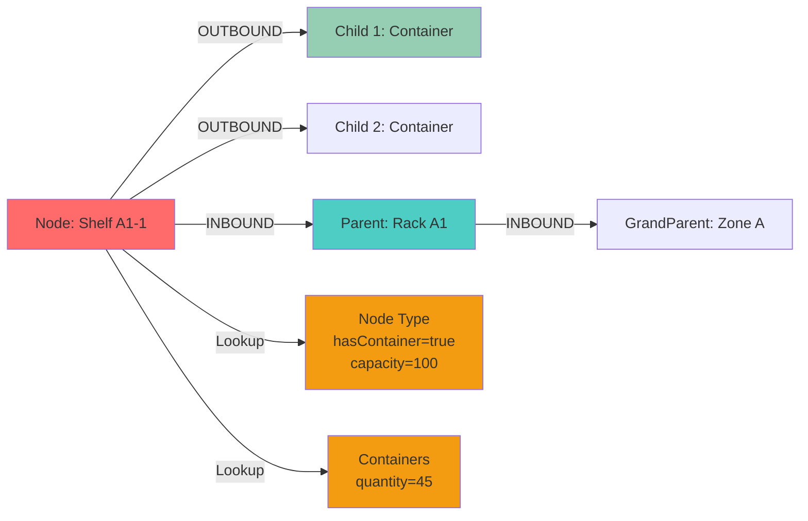
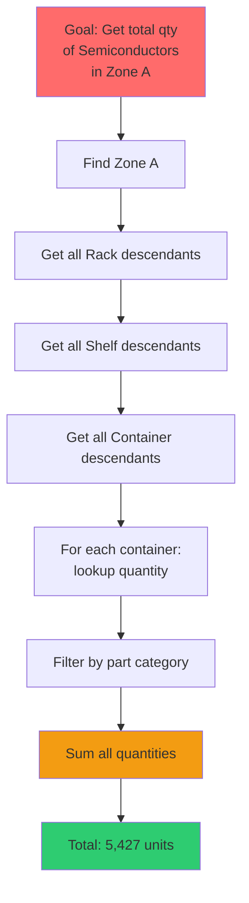
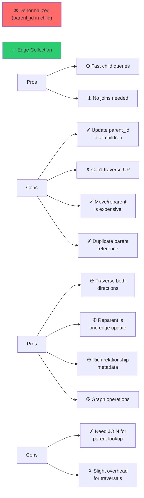

# Edge Patterns Explained

## What are Edge Collections?

Edge collections in ArangoDB are special document collections designed to represent **relationships between documents**. Each edge document has two mandatory fields:

- `_from`: The ID of the source document
- `_to`: The ID of the destination document
- All other fields are optional and can store relationship metadata

```typescript
// Example edge document
{
  _key: "semiconductors-to-electronics",
  _from: "part_cats/semiconductors",
  _to: "part_cats/electronics",
  order: 1,
  status: "active"
}
```

## Pattern 1: Hierarchical Category Trees

### Overview

Categories are organized in a multi-level tree structure where:
- Each category can have **one or more parent categories**
- Each category can have **multiple child categories**
- Properties can be inherited from ancestors
- Deletions can cascade through descendants

### Schema



### Data Flow



### Query Pattern: Find All Descendants at Depth

**Why this matters**: You want to show a category and all its direct children (depth 1) or full subtree (depth ∞).

```aql
LET parentKey = @parentKey
LET depth = @depth  // 1 for direct children, 'LARGEST_INT' for all

FOR doc, edge, path IN 1..depth OUTBOUND parent part_cats_links
  FILTER doc._deleted == null
  RETURN {
    _key: doc._key,
    name: doc.name,
    code: doc.code,
    level: path.vertices[*]._key[* - 1]
  }
```

### Query Pattern: Get Full Ancestry Chain

**Why this matters**: Trace from any category all the way up to root for breadcrumb navigation.

```aql
FOR doc, edge, path IN 0..100 INBOUND category part_cats_links
  FILTER doc._deleted == null
  RETURN {
    level: LENGTH(path.vertices),
    _key: doc._key,
    name: doc.name
  }
```

### Visualization: Query Execution



### Cascade Deletion Pattern

**Problem**: When you delete a parent category, what happens to children?

**Solution**: Use mutations to find and delete all related edges first.

```aql
// Step 1: Find all child edges pointing TO this category
FOR edge IN part_cats_links
  FILTER edge._to == @categoryId
  REMOVE edge IN part_cats_links

// Step 2: Find all parent edges coming FROM this category  
FOR edge IN part_cats_links
  FILTER edge._from == @categoryId
  REMOVE edge IN part_cats_links

// Step 3: Finally delete the category itself
REMOVE @categoryId IN part_cats
```

---

## Pattern 2: Warehouse Node Hierarchy

### Overview

Warehouse locations form a tree:

```
Storage (Root)
  └── Zones (level 1: "Electronics", "Mechanical")
      └── Racks (level 2: "Rack A1", "Rack B3")
          └── Shelves (level 3: "Shelf A1-1", "Shelf A1-2")
              └── Containers (level 4: items stored here)
```

### Schema



### Key Difference from Categories

Unlike categories which are simpler, warehouse nodes need **bidirectional queries**:



### Query Pattern: Get Full Node Ancestry

**Why this matters**: Navigate from any location back to the storage root for context.

```aql
FOR node, edge, path IN 0..100 INBOUND currentNode w_node_links
  RETURN {
    depth: LENGTH(path.vertices),
    _key: node._key,
    code: node.code,
    type: node.type
  }
```

### Query Pattern: Get Subtree with Capacity

**Why this matters**: Find all child locations and their current capacity usage.

```aql
LET currentNode = @nodeKey
FOR node, edge, path IN 1..100 OUTBOUND currentNode w_node_links
  LET nodeType = FIRST(
    FOR type IN w_node_types
      FILTER type._key == node.type
      RETURN type
  )
  LET containers = (
    FOR container IN w_containers
      FILTER container.node == node._key
      RETURN container
  )
  LET usedCapacity = SUM(containers[*].quantity)
  RETURN {
    node: node,
    capacity: nodeType.capacity,
    used: usedCapacity,
    available: nodeType.capacity - usedCapacity,
    containerCount: LENGTH(containers)
  }
```

### Query Pattern: Get Storage Root from Any Node

**Why this matters**: Find which storage facility any item is in, regardless of depth.

```aql
FOR node, edge, path IN 0..100 INBOUND startNode w_node_links
  FILTER path.edges[-1].source == null || CONTAINS(path.edges[-1]._from, 'w_storages/')
  RETURN {
    storage: node,
    depth: LENGTH(path.vertices),
    path: path.vertices[*]._key
  }
```

---

## Pattern 3: Advanced Traversals & Aggregations

### Complex Real-World Scenario

Calculate total inventory quantity in a warehouse zone including:
1. All containers recursively
2. Across all subtree nodes
3. With container type information
4. Filtered by product category



### Query Pattern: Multi-Level Aggregation

```aql
LET zoneKey = @zoneKey
LET categoryFilter = @categoryKey

// Get all descendant nodes
LET allNodes = (
  FOR node IN 1..100 OUTBOUND zoneKey w_node_links
    RETURN node._key
)

// For each node, get containers and sum
LET inventory = (
  FOR nodeKey IN allNodes
    LET containers = (
      FOR container IN w_containers
        FILTER container.node == nodeKey
        LET item = FIRST(
          FOR part IN parts
            FILTER part._key == container.part_id
            LET itemCategory = FIRST(
              FOR cat IN part_cats
                FILTER cat._key == part.category
                RETURN cat._key
            )
            FILTER itemCategory == categoryFilter
            RETURN { _key: part._key, qty: container.quantity }
        )
        FILTER item != null
        RETURN item.qty
    )
    RETURN { node: nodeKey, qty: SUM(containers) }
)

RETURN {
  zone: zoneKey,
  category: categoryFilter,
  nodes: LENGTH(allNodes),
  containers: LENGTH(FLATTEN(inventory)),
  totalQuantity: SUM(inventory[*].qty)
}
```

### Comparison: Edge vs Denormalization



---

## Common Pitfalls & Solutions

### Pitfall 1: No Filtering on _deleted

**Problem**: When you soft-delete, old documents still returned in traversals.

```aql
// ❌ WRONG - returns deleted categories
FOR doc IN 1..100 OUTBOUND parent part_cats_links
  RETURN doc

// ✅ CORRECT - filters deleted
FOR doc IN 1..100 OUTBOUND parent part_cats_links
  FILTER doc._deleted == null
  RETURN doc
```

### Pitfall 2: Unbounded Traversals

**Problem**: Circular edges or very deep trees can timeout.

```aql
// ❌ WRONG - infinite traversal
FOR doc IN OUTBOUND parent part_cats_links
  RETURN doc

// ✅ CORRECT - bounded depth
FOR doc IN 1..10 OUTBOUND parent part_cats_links
  RETURN doc
```

### Pitfall 3: Missing Index Direction

**Problem**: Edge indexes need direction for optimal performance.

```aql
// Index for outbound traversals (child lookup)
db.part_cats_links.ensureIndex({
  fields: ["_from"],
  type: "persistent"
})

// Index for inbound traversals (parent lookup)
db.part_cats_links.ensureIndex({
  fields: ["_to"],
  type: "persistent"
})
```

---

## Summary Table

| Pattern | Use Case | Primary Operation | Example |
|---------|----------|-------------------|---------|
| **Category Tree** | Product hierarchies | OUTBOUND (find children) | "Show all Semiconductors under Electronics" |
| **Warehouse Nodes** | Location trees | Bidirectional (parent + children) | "Find all shelves in Rack A + parent Zone" |
| **Traversal + Aggregation** | Complex analytics | Multi-path joins | "Total Semiconductors qty in Zone A" |

---

**Next**: See [architecture.md](architecture.md) for system design details.
