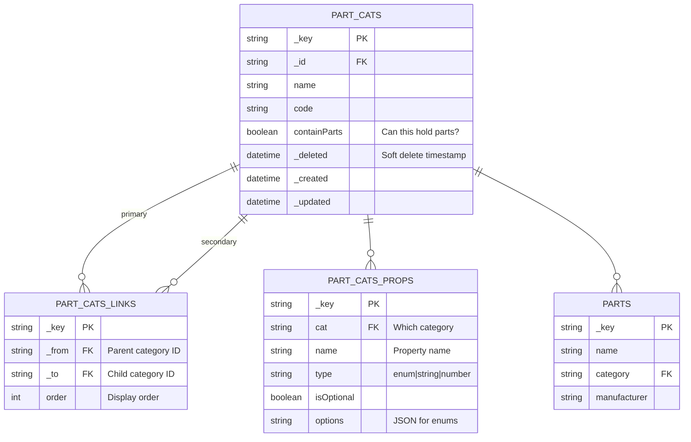

# Hierarchical Categories - Entity Relationships

## Overview Diagram



## Relationship Types

### 1. Self-Referencing Edge (Hierarchy)

**Pattern**: Category → part_cats_links → Category

**Purpose**: Create tree structure of categories

**Example**:
```
Electronics (_key: "electronics", _id: "part_cats/electronics")
    ↓ edge._from: "part_cats/electronics"
    ↓ edge._to: "part_cats/semiconductors"
Semiconductors (_key: "semiconductors", _id: "part_cats/semiconductors")
    ↓ edge._from: "part_cats/semiconductors"
    ↓ edge._to: "part_cats/ics"
ICs (_key: "ics", _id: "part_cats/ics")
```

**Direction**:
- **OUTBOUND** (parent → children): Find all products in a category and subcategories
- **INBOUND** (children → parent): Find parent categories (ancestors) of a product

### 2. Document Reference (Properties)

**Pattern**: Category → part_cats_props

**Purpose**: Store properties/attributes inherited by category

**Example**:
```
Electronics
    has Property: tolerance = "±10%"
    has Property: voltage_class = "high"
    has Property: temperature_range = "-40 to +85°C"
```

### 3. Document Reference (Contents)

**Pattern**: Category → parts

**Purpose**: Track which parts belong to this category

**Example**:
```
Transistors category contains:
  - 2N2222 BJT Transistor
  - BF245 JFET Transistor
  - 2N7000 MOSFET
```

## Traversal Examples

### Example 1: Down the Tree (OUTBOUND)

```
Query: "Show all subcategories under Electronics"

part_cats/electronics
  ← part_cats_links._from
  ← part_cats_links._to →
  → part_cats/semiconductors (found)
  → part_cats/passives (found)
  
part_cats/semiconductors
  ← part_cats_links._from
  ← part_cats_links._to →
  → part_cats/ics (found)
  → part_cats/transistors (found)
```

### Example 2: Up the Tree (INBOUND)

```
Query: "What categories is ICs under?"

part_cats/ics
  ← part_cats_links._to
  ← part_cats_links._from ←
  ← part_cats/semiconductors (found)
  
part_cats/semiconductors
  ← part_cats_links._to
  ← part_cats_links._from ←
  ← part_cats/electronics (found)
```

### Example 3: Bidirectional at Depth

```
Query: "Get full ancestry and descendants of Semiconductors"

Ancestors (INBOUND):        Node:                Descendants (OUTBOUND):
                    Electronics
                        ↑
                    (INBOUND)
                        ↑
                  Semiconductors ← ROOT
                        ↓
                    (OUTBOUND)
                        ↓
        ┌───────────────┼───────────────┐
        ↓               ↓               ↓
       ICs       Transistors      Diodes
```

## Soft Delete Handling

Soft deletes add complexity to traversals:

```
BEFORE soft delete:
Electronics
  ↓ Semiconductors
    ↓ ICs
    ↓ Transistors (DELETED)
  ↓ Passives
    ↓ Resistors
    ↓ Capacitors

AFTER soft delete (without filter):
Electronics
  ↓ Semiconductors (but contains "deleted" child)
    ↓ ICs
    ↓ Transistors 👻 (marked as deleted)
  ↓ Passives

QUERY FILTER NEEDED:
WHERE doc._deleted == null
```

Most queries should filter: `FILTER doc._deleted == null`

## Edge vs Document Storage Decision

### Why Edges for Categories?

```
Option A: Store parent_id in category document
{
  _key: "transistors",
  name: "Transistors",
  parent_id: "semiconductors",  // ❌ Can't traverse UP
  _deleted: null
}
Problem: 
  - Can't find parents (need expensive scan)
  - Moving node requires updating child documents
  - Can't have multiple parents

Option B: Use Edge Collection
Edge in part_cats_links:
{
  _from: "part_cats/semiconductors",
  _to: "part_cats/transistors",
  order: 1
}
Benefits:
  ✓ Traverse UP (INBOUND) easily
  ✓ Move node (update one edge)
  ✓ Multiple parents possible
  ✓ Rich relationship metadata
```

## Performance Characteristics

| Operation | Index | Time |
|-----------|-------|------|
| Get children (depth 1) | _from index | O(log n) |
| Get all descendants | _from index | O(k) where k = descendants |
| Get parents | _to index | O(log n) |
| Get ancestors | _to index | O(m) where m = ancestors |
| Add child | _from, _to indexes | O(log n) |
| Move node | none | O(1) |
| Delete with cascade | _from, _to indexes | O(k) |

## Common Query Patterns

### Pattern 1: Breadcrumb Navigation
```typescript
// Path from root to current category
ancestors = queryAncestors(currentCategoryId)
// Result: [Electronics, Semiconductors, ICs]
```

### Pattern 2: Category Listing
```typescript
// All direct children for UI select
children = queryDirectChildren(parentCategoryId)
// Result: Array of immediate children
```

### Pattern 3: Product Tree
```typescript
// Full tree recursively
tree = buildCategoryTree(rootCategoryId, maxDepth: 4)
// Result: Nested structure for tree view
```

### Pattern 4: Validation
```typescript
// Check if category exists and has parent
exists = categoryExists(categoryKey)
hasParent = hasParentCategory(categoryKey)
```

### Pattern 5: Data Inheritance
```typescript
// Get all properties from ancestors
allProps = getInheritedProperties(categoryKey)
// Parents' properties + this category's properties
```

---

**Next**: See [../../docs/edge-patterns-explained.md](../../docs/edge-patterns-explained.md) for detailed patterns.
